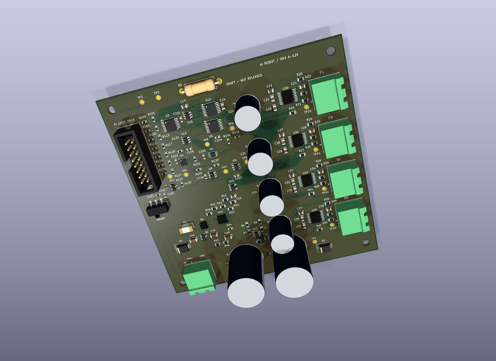

# AI Robot — 12 V Motor Interface, Rev A

**PROVISIONAL REFERENCE DESIGN — NOT VERIFIED FOR THE EXISTING ROBOT.**
**DRAFT — NOT RELEASED FOR FABRICATION.**

This project documents a Raspberry Pi 5 four-wheel robot and a proposed custom motor-control PCB. The purchased prototype has four listed 12 V / 30:1 GMR encoder motors and two TB6612 dual-channel breakout boards. A review of hardware records exposed an incorrect 6 V assumption in the first, unbuilt PCB draft. That pre-fabrication finding is preserved in the [revision history](hardware/rev_a/docs/revision_history.md) and [frozen 6 V archive](hardware/rev_a_6v_archive/ARCHIVE_NOTICE.md).

The replacement draft uses **four DRV8874 bridges with per-motor current regulation**, an eFuse and reverse-polarity stage, revised transient protection, separate Pi power, and hardware command gating, watchdog and arming circuits. Each motor has its own electrical output; front and rear commands remain paired by side. The exact motor model, maximum battery voltage, installed power connections and GPIO wiring still need physical confirmation. “12 V” does not establish a 12.6 V pack maximum.

[Open the native KiCad design and engineering review](hardware/rev_a/README.md) · [Power-path review](hardware/rev_a/docs/power_path_review_12v.md) · [Driver decision](hardware/rev_a/docs/driver_margin_review.md) · [Existing versus proposed wiring](hardware/rev_a/docs/wiring_guide.md)

## Design evidence

The reference design has seven schematic sheets, a provisional 100 × 100 mm two-layer board and 121 fitted component placements plus 14 copper test points. The [design check report](hardware/rev_a/validation/design/design_check_report.md) records final ERC 0, DRC 0, unconnected 0 and schematic parity 0, together with the exact input identities and limits. ERC/DRC assess CAD consistency, not electrical, thermal or robot-level validation.

*CAD rendering with nominal package models; no physical board was built.*

[Schematic PDF](hardware/rev_a/exports/draft/schematic.pdf) · [PCB PDF](hardware/rev_a/exports/draft/pcb_layout.pdf) · [Draft exports](hardware/rev_a/exports/draft/README.md) · [Design explanations](hardware/rev_a/docs/design_decisions.md) · [Component count](hardware/rev_a/docs/component_count_review.md)

## Software and physical status

Motor software is **mock-only**, starts disarmed and requires explicit ownership and arming with commands that expire. AI has stop-only authority. The [132 offline mock-test records](hardware/rev_a/validation/software_test_report.md) are preserved; they do not validate the PCB. The new board's RUN/ARM/heartbeat/PWM/DIR protocol has no real GPIO backend yet. See the [software guide](pi_robot/README.md) and [vision integration guide](docs/vision_safety_integration.md).

**Fabrication: DEFERRED. Assembly: NOT ASSEMBLED. Physical validation: NOT TESTED. Proposed-PCB integration: NOT TESTED.** No fabrication, vendor order or physical testing was performed. Design artifacts were produced with AI assistance and require engineering review and physical qualification before release. [Historical prototype notes](docs/legacy_project_notes.md) are retained separately from this design.
