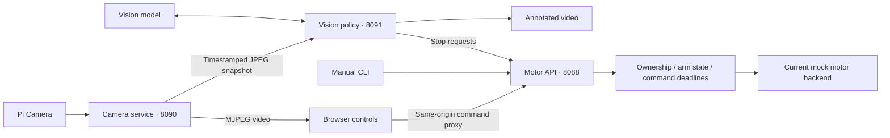

# AI Robot — Raspberry Pi Vision & Motor Control

AI Robot is a four-wheel Raspberry Pi robot project combining motor control, live camera video, a browser driving interface, and AI-assisted visual observation. A shared HTTP motor service connects the browser, command-line controller, and vision process, so camera processing and user interfaces can evolve independently of motor control.

The robot platform uses a **Raspberry Pi 5, four geared DC motors, two TB6612FNG dual-channel driver boards, a Pi Camera, a USB microphone, and a speaker**. This repository contains the Python services, control logic, tests, wiring documentation, and a custom four-motor interface PCB design.

## What the project includes

- **Motor control service:** a Flask API for direction, speed, short movement commands, stopping, and control ownership.
- **Live camera and browser interface:** MJPEG video, a latest-frame snapshot endpoint, directional buttons, a speed slider, and explicit reset/arm controls.
- **Vision policy:** camera snapshots are sent to a vision model for person and stop-sign observations. An annotated video stream shows the result; the current policy can request a stop and does not initiate movement.
- **Command-line control:** a text interface for the same motor API, including speed changes and short directional commands. The `voice_ai_motor_simple.py` filename comes from earlier voice-control work; this script is currently a manual CLI.
- **Motor interface PCB:** editable KiCad schematics and layout, component selection, power calculations, wiring diagrams, BOM, and fabrication-format exports for a 12 V-class redesign.
- **Offline verification:** 132 mock tests cover the control state machine, API, clients, camera interfaces, and vision parsing.

The hardware prototype and the current software backend are distinct parts of the project: **the checked-in motor service currently uses a mock backend**, so running it exercises commands without driving GPIO. Its control contract and the proposed PCB's hardware interface are documented for the next integration step.

## System architecture



The motor API is the command boundary. The browser and CLI request manual control; the vision process supplies observations and stop requests. A command belongs to one source/session and expires unless it is replaced by another valid command. Stopping or expiry clears the control lease. This keeps UI state, camera processing, and motor state explicit across separate processes.

## Robot hardware

| Subsystem | Project hardware |
| --- | --- |
| Compute | Raspberry Pi 5, 4 GB camera kit |
| Drivetrain | Two WHEELTEC R3 two-wheel chassis sets, giving four geared DC motors |
| Motor purchase specification | 12 V, 30:1 reduction, 500-line GMR encoder version |
| Motor drivers | Two TB6612FNG dual-channel boards |
| Batteries purchased | Two packs listed as 12 V, 2500 mAh, with built-in protection |
| Vision | Pi Camera, accessed by the camera service through OpenCV |
| Audio | USB microphone and speaker for voice-interaction experiments |

Each driver channel has its own motor connection:

| Existing driver | Channel A | Channel B |
| --- | --- | --- |
| Board A | Front-left motor | Front-right motor |
| Board B | Back-left motor | Back-right motor |

The Pi controls the existing driver boards directly; there is no Arduino in the motor-control loop. The Pi has separate power, while the motor source feeds the drivers' VM inputs. Pi ground, driver grounds, and motor-battery negative share a reference. The installed arrangement of the two purchased packs and the complete GPIO harness still need to be recorded. The purchased encoders are not yet integrated into wheel-speed feedback.

The exact motor label is still unconfirmed; MG513P30_12V is a candidate, not an established part number. Pack chemistry and actual minimum/maximum voltage also remain open. The [hardware record](hardware/rev_a/docs/actual_hardware_evidence.md) and [wiring guide](hardware/rev_a/docs/wiring_guide.md) separate the known connections from these remaining details.

## Software modules

| File | Role |
| --- | --- |
| [`web_motor.py`](pi_robot/web_motor.py) | Flask `/cmd` and `/status` endpoints; motor-service lifecycle |
| [`motor_control.py`](pi_robot/motor_control.py) | Ownership, arming, command validation, deadlines, and stop state |
| [`motor_backend.py`](pi_robot/motor_backend.py) | Mock implementation of motor outputs |
| [`motor_config.py`](pi_robot/motor_config.py) | Command bounds, timeouts, and motor configuration |
| [`web_vision_drive_picam_ai.py`](pi_robot/web_vision_drive_picam_ai.py) | Camera worker, video/snapshot routes, browser UI, and motor proxy |
| [`vision_policy_daemon.py`](pi_robot/vision_policy_daemon.py) | Snapshot acquisition, model requests, observation age checks, and overlay stream |
| [`vision_safety.py`](pi_robot/vision_safety.py) | Strict observation parsing and stop-only policy |
| [`voice_ai_motor_simple.py`](pi_robot/voice_ai_motor_simple.py) | Interactive text controller using the motor API |

The camera service publishes `/stream.mjpg` for display and `/snapshot.jpg` for policy input. The policy checks frame identity and age before and after model inference. A stop sign, a near/mid-distance person, or invalid/stale input produces a stop request. A negative detection does not arm the robot or resume an earlier command. The policy's annotated output is available at `/overlay.mjpg`.

## Run the software

From the repository root, create a Python 3.10+ environment and install the application dependencies:

```sh
python3 -m venv .venv
source .venv/bin/activate
python -m pip install -r pi_robot/requirements.txt
```

Start the motor service:

```sh
MOTOR_BACKEND=mock python pi_robot/web_motor.py
```

In another terminal using the same environment, start the CLI:

```sh
MOTOR_URL=http://127.0.0.1:8088 python pi_robot/voice_ai_motor_simple.py
```

A command sequence is:

```text
reset
arm
f
```

Send `f` within one second of `arm`; otherwise the idle lease expires. `f` requests 0.25 seconds of forward movement in the mock backend. Expiry latches stop; use `reset` and `arm` again for another movement. `s` stops and disarms; `q` stops and exits.

On a system with a configured camera, start the camera/browser service in a third terminal:

```sh
MOTOR_URL=http://127.0.0.1:8088 CAM_W=320 CAM_H=240 CAM_FPS=15 python pi_robot/web_vision_drive_picam_ai.py
```

Open `http://127.0.0.1:8090/` on that host for video and controls. The services bind to loopback by default. The [software guide](pi_robot/README.md) covers camera configuration, optional model startup, local access, environment variables, and the API. Camera startup opens a real device; the motor backend remains mock. Voice recognition, wake-word handling, and speech synthesis are not integrated into the current CLI.

## Tests

```sh
python -m pip install -r tests/hardware_mock/requirements.txt
python -m pytest tests/hardware_mock -q
```

The recorded suite has **132 passing tests**. It uses injected clocks, camera frames, HTTP/model responses, and motor outputs. Coverage includes invalid commands, ownership conflicts, expired leases, reversal sequencing, stop behavior, malformed vision results, stale frames, and client shutdown. See the [test guide](tests/hardware_mock/README.md) and [vision integration details](docs/vision_safety_integration.md).

## Custom motor-control PCB

The PCB work consolidates the prototype's jumper-wire motor, power, and control connections. A hardware-record review corrected an initial 6 V assumption to a 12 V-class design. The current board uses **four DRV8874 bridges**, one per motor, with individual current regulation, a protected common motor input, and hardware watchdog/arming logic. Front and rear motors remain commanded together by side; their power outputs are separate.

The editable design has seven schematic sheets, a provisional 100 × 100 mm two-layer layout, 121 fitted components, and 14 copper testpoints. Native checks report **ERC 0, DRC 0, unconnected 0, and schematic parity 0**. The board is a design-stage subsystem; matching it to the installed motors, packs, harness, and chassis is part of the remaining integration work.

[KiCad project and board documentation](hardware/rev_a/README.md) · [Schematic PDF](hardware/rev_a/exports/draft/schematic.pdf) · [PCB PDF](hardware/rev_a/exports/draft/pcb_layout.pdf) · [BOM](hardware/rev_a/exports/draft/bom_fitted.csv) · [3D view](hardware/rev_a/exports/draft/views/kicad_3d_render.png)

## Project documentation and next steps

- [Software setup and API](pi_robot/README.md)
- [Project development and design decisions](docs/project_development.md)
- [Camera, vision, and client integration](docs/vision_safety_integration.md)
- [Existing and proposed wiring](hardware/rev_a/docs/wiring_guide.md)
- [Motor-driver selection](hardware/rev_a/docs/driver_margin_review.md) and [power-path design](hardware/rev_a/docs/power_path_review_12v.md)
- [PCB checks and source identities](hardware/rev_a/validation/design/design_check_report.md)

The next integration steps are to finish the actual motor/battery/harness record, implement and check a real GPIO backend, integrate encoder feedback, and evaluate the custom PCB against the robot's electrical and mechanical requirements. Camera timing, vision response, motor behavior, and the audio interface remain separate areas for continued development.
