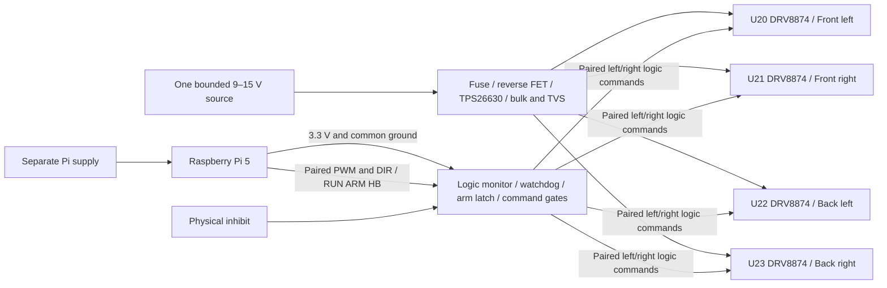
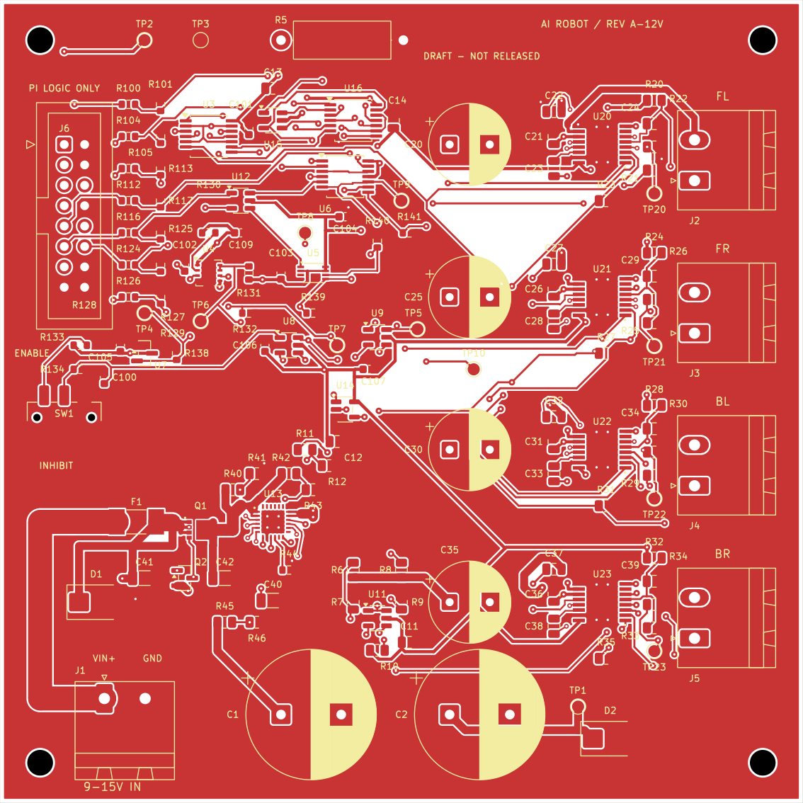

# AI Robot Rev A — 12 V Reference Redesign

**PROVISIONAL REFERENCE DESIGN — NOT VERIFIED FOR THE EXISTING ROBOT.**
**DRAFT — NOT RELEASED FOR FABRICATION.**

The purchased prototype comprises four listed 12 V geared motors and two TB6612 dual-channel boards. The initial custom-PCB draft assumed 6 V; that mismatch was found before fabrication. The complete [6 V archive](../rev_a_6v_archive/ARCHIVE_NOTICE.md) preserves the earlier CAD, checks and design assumptions. No failed-board story is claimed.

The current draft selects four DRV8874PWPR bridges. Data for the candidate MG513P30_12V lists a 3.2 A stall current, while Toshiba's 3.2 A figure is a restricted absolute peak condition with no sustained stall margin. The candidate is not the confirmed installed motor. Read the [driver analysis](docs/driver_margin_review.md) for the rejected dual-TB branch, DRV current regulation, thermal limits and compatibility tradeoffs.

The source envelope is **9–15 V continuous, one source input, ≤2 A normal aggregate current, ambient ≤40 °C**. These are provisional design bounds, not measured battery specifications or an assumed cell count. The board has an approximately 2.98 A eFuse current-limit setting and approximately 0.79 A chopping settings per motor; tolerance ranges, startup interactions and transient restrictions are specified in the [electrical reference](docs/reference_electrical_spec.md). Four simultaneous starts can exceed the eFuse threshold; successful startup is not guaranteed.

## Circuit and evidence

| Item | Files |
|---|---|
| Editable KiCad 10 project | [Project](ai_robot_interface.kicad_pro), [seven-sheet schematic](ai_robot_interface.kicad_sch), [PCB](ai_robot_interface.kicad_pcb) |
| Confirmed and unknown hardware | [Evidence audit](docs/actual_hardware_evidence.md), [requirements/assumptions](docs/requirements_assumptions.md), [source review](docs/wheeltec_source_review.md) |
| Power / driver review | [Full component rating matrix](docs/power_path_review_12v.md), [power circuit](docs/power_circuit_spec.md), [driver margin](docs/driver_margin_review.md) |
| Control and wiring | [Hardware permission](docs/enable_interface_spec.md), [J6 pin map](docs/pin_map.md), [wiring guide](docs/wiring_guide.md) |
| Design decisions | [Engineering explanation](docs/design_decisions.md), [121-component breakdown](docs/component_count_review.md) |
| Layout and manufacture | [Routing rationale](docs/routing_rationale.md), [footprints](docs/footprint_review.md), [fabrication](docs/fabrication_notes.md), [assembly](docs/assembly_notes.md) |
| Candidate BOM | [Per-reference CSV](exports/draft/bom_fitted.csv), [grouped CSV](exports/draft/bom_grouped.csv), [BOM review](docs/bom_review.md) |
| Actual check evidence | [Check report](validation/design/design_check_report.md), [command log](validation/design/command_log.json), [progress](PROGRESS.md), [workflow](docs/cad_workflow.md) |
| Physical work deferred | [Bring-up plan](validation/bring_up.md), [blank test records](validation/physical_test_records.csv) |

Drivers wake before arming so their normal wake-up fault pulse cannot create a sleep/fault feedback lockout. Output command gates force both inputs of every bridge low while disarmed. With the design armed, PWM low gives brake decay; software disarm gives coast. Physical inhibit additionally drives nSLEEP and eFuse shutdown low. Stored energy remains in VM capacitors: this is not a certified emergency stop or galvanic isolation. J6 is a custom 16-pin logic harness, not a Pi HAT connector. No encoder interface is included.

## Review exports

*Nominal/generic model visualization, not a photograph or chassis-fit validation.*

[Schematic PDF](exports/draft/schematic.pdf) · [PCB copper PDF](exports/draft/pcb_layout.pdf) · [Assembly PDF](exports/draft/assembly_top.pdf) · [Draft manufacturing folder](exports/draft/README.md)

The current source and exported files must be assessed with the actual [native check report](validation/design/design_check_report.md). Previous 6 V zero-error reports apply only to the archived board. CAD checks do not establish ratings, hot-plug behavior, thermal performance, torque, BMS coordination or real-robot compatibility.

## Status

Fabrication **DEFERRED**; assembly **NOT ASSEMBLED**; physical validation **NOT TESTED**; integration **NOT TESTED**. The exact motor label, actual running/startup/stall profiles, battery chemistry/min/max/topology and fault capability, Pi supply, both driver-module GPIO/power mappings, switches/E-stop, mechanics and manufacturing process remain unconfirmed.

The [132 prior offline mock-test records](validation/software_test_report.md) remain unchanged. Software has no physical backend for the new hardware contract. AI has stop-only authority. No board was ordered or tested; GitHub publication is source/documentation publication only.
