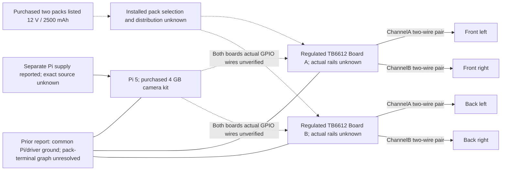
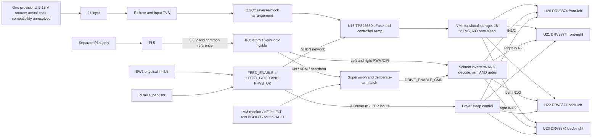

# Wiring guide — existing robot and proposed 12 V redesign

**DRAFT — NOT RELEASED FOR FABRICATION OR VERIFIED FOR THE EXISTING ROBOT.**
This guide explains design connectivity. It is not a completed installation record or an instruction to connect or energize the draft board. Final native CAD checks are recorded in the [check report](../validation/design/design_check_report.md); physical continuity, motor polarity and GPIO integration are not tested.

The prior 6 V reference is frozen in [rev_a_6v_archive](../../rev_a_6v_archive/README.md). The current design replaces its two TB6612s with four DRV8874s and a controlled eFuse/reverse-blocking input. A “12 V” purchase label alone does not prove that the new provisional 9–15 V source envelope fits the actual packs.

## Existing robot evidence

Solid wheel links reflect the user's reported assignment. Dashed links show unknown installed wiring. Two purchased packs do not establish series/parallel wiring, one pack per board or whether one is spare. The earlier report of one battery feeding both VM inputs is retained as history and needs reconciliation. Independently supplied Pi and common ground remain the last user report.

The four purchased motors are listed 12 V, 30:1, 500-line GMR; exact MG513 model, current, lead polarity and encoder pinout/levels/count convention remain unresolved. “Regulated” carrier-board wording does not prove a motor-voltage step-down function or establish VCC. No Arduino is in the reported control path. [Actual hardware evidence](actual_hardware_evidence.md) distinguishes these facts from proposals.

## New power and command paths

The ground reference is common; the board provides no galvanic isolation and no Pi 5 V supply. VM/output current returns belong to the power/ground copper, not the Pi harness return wires.

**Sleep/feed permission and motion permission are separate.** FEED_ENABLE depends on the logic rail and physical switch, independent of ARM, RUN, watchdog, fault and PGOOD. Physically enabling the board may charge VM and wake the drivers while command permission remains blocked. This avoids a power-good/wake-up deadlock. A valid rail/fault state and a fresh ARM edge are still required to command motion.

SW1 inhibit lowers driver nSLEEP and eFuse SHDN, unlike the archived board's STBY-only switch. It interrupts the source feed through the semiconductor path; it does not galvanically isolate the motor terminals or immediately discharge stored VM. RUN/watchdog/fault disarm instead forces both command inputs low while physically enabled drivers can remain awake. Details are in [power_circuit_spec.md](power_circuit_spec.md) and [enable_interface_spec.md](enable_interface_spec.md).

The design targets approximately 0.791 A chopping per bridge and 2.980 A aggregate input limiting. These are nominal thresholds, not instantaneous guarantees or motor stall protection. Four simultaneous starts may trip the eFuse. Actual pack current limits are not inferred from listing claims. Regeneration remains bounded at 0.1 J/event and 0.1 Hz, starting at ≤15 V; reverse blocking retains energy on VM instead of proving the pack can absorb it.

## Motor outputs

| Wheel | New driver / bridge | Connector | Pin 1 / pin 2 |
|---|---|---|---|
| Front-left | U20 | J2 | FL_OUT1 / FL_OUT2 |
| Front-right | U21 | J3 | FR_OUT1 / FR_OUT2 |
| Back-left | U22 | J4 | BL_OUT1 / BL_OUT2 |
| Back-right | U23 | J5 | BR_OUT1 / BR_OUT2 |

Each driver powers one motor through its own output pair: four pairs/eight terminals. The two left drivers share logic commands, as do the two right drivers. Their power outputs remain separate. Paired PWM/direction does not impose equal motor current or speed. Independent wheel control or encoder feedback would require an additional reviewed interface/backend.

J1.1 is positive MOTOR_IN; J1.2 is GND. Motor pin 1 is a terminal label, not verified forward polarity. Neither motor output is a permanent ground. Output pairs are not connected in parallel.

## Proposed J6 cable

This is a new cable allocation, **not actual existing GPIO evidence**. J6 is a keyed 2×8 logic connector, not a Pi HAT header. Match contacts to the manufacturer's mating drawing and the native pin 1 mark; an opposite-face cable view may be mirrored. Full numbering and testpoint details are in [pin_map.md](pin_map.md).

| J6 pin | Role | Proposed Pi BCM / rail | Pi physical pin |
|---:|---|---|---:|
| 1 | PI_3V3 | 3.3 V | 1 |
| 2 | GND | Ground | 6 |
| 3 | Left PWM | BCM18 | 12 |
| 4 | GND | Ground | 9 |
| 5 | Left DIR | BCM23 | 16 |
| 6 | Reserved NC; not GND | **No connection** | — |
| 7 | Right PWM | BCM13 | 33 |
| 8 | GND | Ground | 14 |
| 9 | Right DIR | BCM5 | 29 |
| 10 | Reserved NC; not GND | **No connection** | — |
| 11 | RUN request | BCM25 | 22 |
| 12 | ARM edge | BCM17 | 11 |
| 13 | Heartbeat | BCM27 | 13 |
| 14 | GND | Ground | 20 |
| 15 | GND; no enable feedback | Ground | 30 |
| 16 | GND | Ground | 25 |

BCM24/6 are no longer used. Pi 5 V pins 2/4 are not connected. No GPIO directly drives a shared driver enable or reads ALL_OK, fault or current nodes in this cable. Future firmware therefore has no hardware-qualification feedback through J6; the gating circuit enforces qualification independently. Required logic levels and harness constraints are documented separately; Pi output levels, alternate-function conflicts and actual continuity remain unverified. [Pi GPIO numbering reference](https://www.raspberrypi.com/documentation/computers/raspberry-pi.html#gpio-and-the-40-pin-header).

## Stop, brake, sleep and remaining energy

| Condition | Intended electrical result | Boundary |
|---|---|---|
| Disarmed / RUN low / missing heartbeat / fault | DRIVE_ENABLE_CMD low; IN1/IN2=00; coast while awake | Does not actively brake or cut the feed when the physical switch remains enabled |
| Armed with PWM=0 | IN1/IN2=11; low-side brake recirculation | “Zero PWM” and disarm are different hardware states |
| Armed with PWM=1 | DIR=0 gives 01, DIR=1 gives 10 | Electrical reverse/forward labels do not establish wheel polarity |
| Physical SW1 inhibit | nSLEEP low, SHDN low, arm latch cleared | Sleep/feed interruption has finite response; stored charge and mechanical motion remain |
| Qualification restored | Latch remains cleared until fresh ARM edge | Internal OCP latch may additionally require physical-enable/power cycling; no automatic motion recovery |
| Pi 3.3 V absent | Defined FEED_ENABLE/nSLEEP and SHDN pull-down paths request disable | Single-VM driver architecture removes the old TB6612 separate-VCC dependency; abrupt-collapse waveforms and arbitrary faults remain unvalidated |

The selected watchdog interval is 170–230 ms; the proposed future heartbeat contract requires falling edges at ≤50 ms. This is neither a measured stopping time nor a stall detector. Fixed-off-time current chopping itself does not assert nFAULT. Software may continue emitting a heartbeat despite a stuck motor.

VM storage is 2.88 mF nominal and R5 is 680 Ω/2 W. The power review's discharge criterion is at least 15 s plus VM<0.3 V with the source absent and no returning mechanical energy. That is a deferred validation/release criterion, not a claim that physical disable instantly makes the board unpowered or an instruction to test hardware in this design-only phase.

The future physical backend must distinguish brake/coast/sleep, hold PWM low before deliberate arming or direction changes, provide the reviewed settling/deceleration behavior, and require rearming after faults. The repository remains mock-only. The preserved 132 mock tests are not evidence of this GPIO handshake, new driver behavior or PCB integration.

Completed [native ERC/DRC/parity results](../validation/design/design_check_report.md) for this exact redesign remain design evidence. Fabrication is **DEFERRED / NOT BUILT**, assembly **DEFERRED / NOT ASSEMBLED**, and physical validation/integration **NOT TESTED**.
