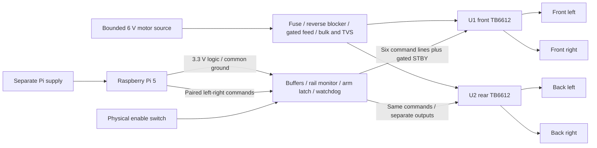
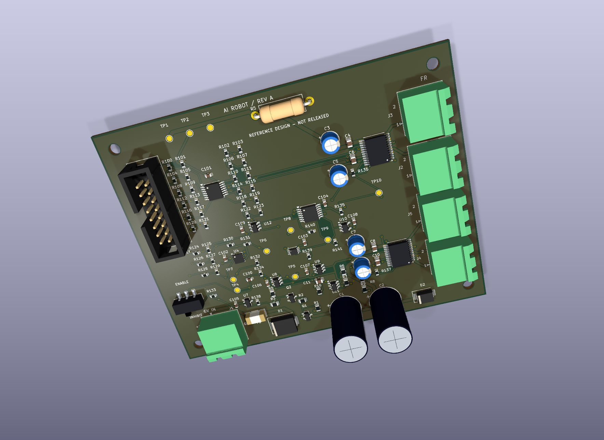
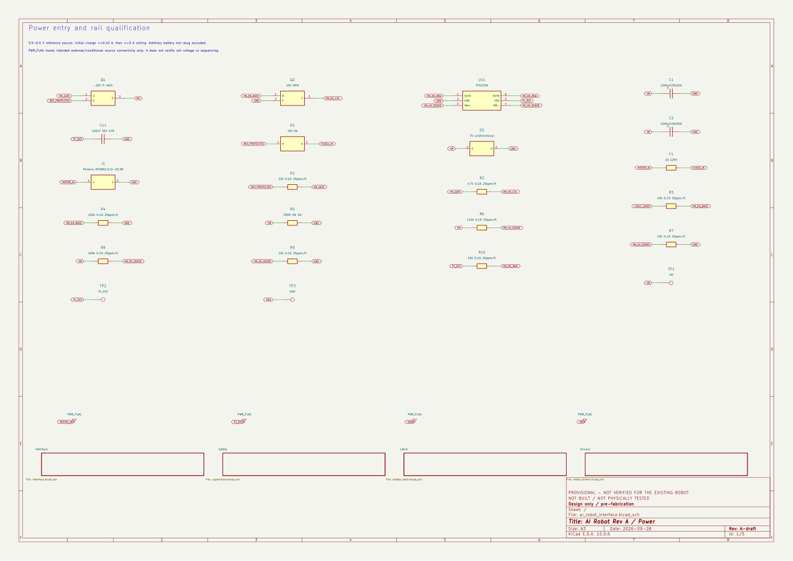
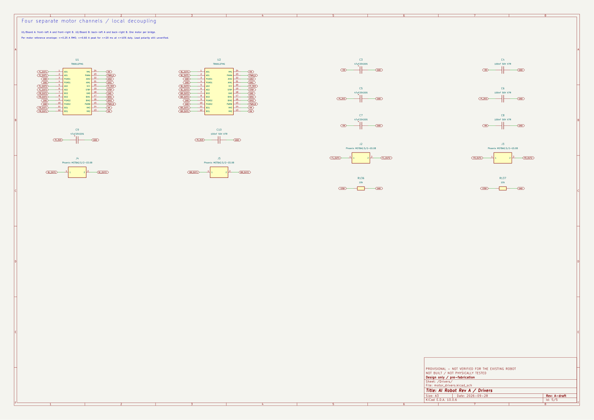
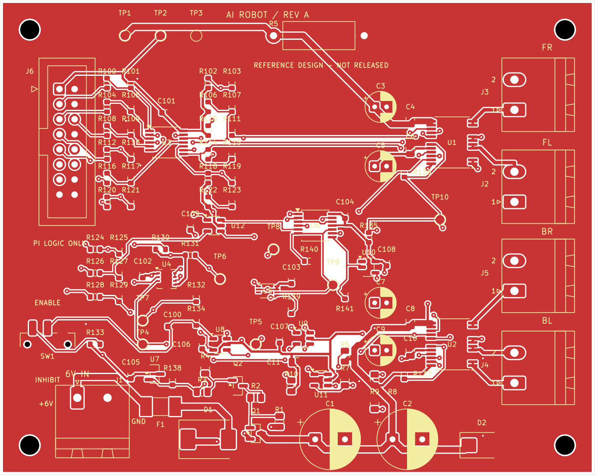
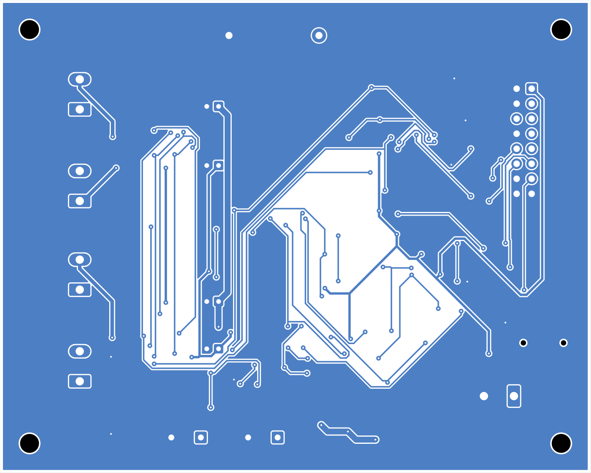

# AI Robot — Four-Motor PCB Design, Pre-Fabrication

**6 V REFERENCE ONLY — DIRECT 12 V INPUT INCOMPATIBLE.** The later purchase-record evidence identifies a listed 12 V motor system. D2 is a 7 V TVS, the VM overvoltage threshold is about 7.16 V, and no 12 V-to-6 V regulator exists. [Read the design-impact review](docs/12v_design_impact.md) before interpreting the preserved CAD or draft exports. A 12 V replacement design has not been completed.

**PROVISIONAL REFERENCE DESIGN — NOT VERIFIED FOR THE EXISTING ROBOT.**
**DRAFT — NOT RELEASED FOR FABRICATION.**

This project extends the existing Raspberry Pi 5 robot by consolidating its two TB6612 motor-driver boards and jumper-wire motor/power/control connections into one proposed custom board. Four motor outputs remain electrically separate. Left/right PWM and direction commands are paired between front and rear drivers; H-bridge outputs are never paralleled. Pi Camera, USB microphone and speaker remain existing Pi peripherals. Arduino is not in the confirmed motor-control loop.

The accepted reference envelope is 6.0 V nominal motor input (5.5–6.5 V), at most 0.25 A RMS per motor and 0.60 A startup peaks lasting at most 20 ms with at most 10% repetition duty, ambient at most 40 °C, separate Pi power, and a provisional 100 × 80 mm two-layer 1 oz board. These are design assumptions accepted by the user, not measured specifications of the robot. The reference additionally requires controlled supply sequencing, initial 0.10 A capacitor charging, a 3 A hard source ceiling with external overload cutoff, bounded regenerated energy, and 3.2–3.4 V logic measured at this board. See the [full operating restrictions and calculations](docs/reference_electrical_spec.md).

## Hardware matching and design explanation

The new [actual-hardware evidence audit](docs/actual_hardware_evidence.md) separates user confirmations, historical code constants and the proposed reference harness. Purchase records now describe two WHEELTEC R3 sets with four 12 V / 30:1 / 500-line GMR motors, two regulated TB6612 boards, two listed 12 V / 2500 mAh protected packs, and a Pi 5 4 GB camera kit. Exact motor identity/current profiles, actual pack voltage bounds/topology, two-module GPIO/VCC wiring and protection behavior remain unknown. MG513P30_12V is a candidate only. Compatibility is now a known voltage mismatch for direct 12 V input, not merely an unknown.

The [wiring guide](docs/wiring_guide.md) contains separate existing/proposed diagrams, four motor-connector mappings and the proposed Pi-to-J6 table. [Design decisions](docs/design_decisions.md) explains all eleven major choices and their tradeoffs. The [component-count review](docs/component_count_review.md) accounts for all 97 placements and identifies simplification candidates: 62 parts serve signal conditioning and permission/supervision beyond basic wiring consolidation.

The delivered board physically shares left/right command inputs; it does not provide four independent wheel commands. SW1 inhibits STBY and clears the arm latch while the logic operates; it does not interrupt VM power. The new RUN/ARM/heartbeat protocol remains unimplemented in a real GPIO backend.

## Editable design and review records

| Item | Evidence |
|---|---|
| Native KiCad 10 project | [Project](ai_robot_interface.kicad_pro), [five-sheet schematic](ai_robot_interface.kicad_sch), [PCB](ai_robot_interface.kicad_pcb) |
| Confirmed facts versus assumptions | [Requirements table](docs/requirements_assumptions.md), [scope](docs/scope_design_only.md) |
| Circuit | [Power circuit](docs/power_circuit_spec.md), [hardware enable and watchdog](docs/enable_interface_spec.md) |
| Pins and packages | [Wheel/header mapping](docs/pin_map.md), [footprint review](docs/footprint_review.md), [project-local libraries](libraries/README.md) |
| Calculations and layout | [Electrical reference budget](docs/reference_electrical_spec.md), [routing rationale](docs/routing_rationale.md) |
| Candidate BOM | [Grouped BOM](exports/draft/bom_reference.tsv), [per-reference BOM](exports/draft/bom_per_reference.tsv), [BOM review](docs/bom_review.md) |
| Manufacturing preparation | [Draft package](exports/draft/README.md), [fabrication notes](docs/fabrication_notes.md), [assembly notes](docs/assembly_notes.md) |
| Deferred physical work | [Bring-up procedure](validation/bring_up.md), [blank test records](validation/physical_test_records.csv) |
| Status and reproducibility | [Progress](PROGRESS.md), [KiCad workflow](docs/cad_workflow.md) |

Hardware permission requires valid logic and motor rails, the physical switch, a live watchdog, RUN_REQ and a new arm edge. A fault clears the latch. The 170–230 ms watchdog is a separate circuit; the Python command-expiry tests do not validate it. J6 is a custom logic cable, **not a Raspberry Pi 40-pin HAT connector**. The new ARM/RUN/heartbeat hardware protocol has not been integrated into a physical GPIO backend.

## Actual design checks and views

KiCad 10.0.6: **0 ERC violations, 0 DRC violations, 0 unconnected items, 0 schematic parity issues**. No DRC rule class is ignored. ERC's SPICE-model check is outside scope. The [check report](validation/design/design_check_report.md), [native command log](validation/design/command_log.json) and [independent pad/net review](validation/design/electrical_board_review.json) preserve the evidence and limitations.

*KiCad-generated render with nominal/generic package models. No physical board was built.*

The native schematic has five sheets and 107 electrical items, including 10 copper test points. The candidate assembly BOM and placement file contain 97 components / 33 distinct MPNs. Four board-only mounting holes are excluded from assembly. [Schematic PDF](exports/draft/schematic.pdf), [copper-layer PDF](exports/draft/pcb_layout.pdf), and [assembly drawing](exports/draft/assembly_top.pdf) are draft review documents.

## Evidence boundaries

- Existing robot/prototype descriptions are historical evidence and user reports; they do not demonstrate the proposed PCB.
- The previous [132 offline mock tests](validation/software_test_report.md) and original JUnit report are retained unchanged. No new software test count is presented as hardware validation.
- Native CAD checks and exports are recorded separately under `validation/design/`. ERC/DRC do not prove electrical safety, thermal behavior, software integration or operation.
- Fabrication: **DEFERRED / NOT BUILT**. Assembly: **DEFERRED / NOT ASSEMBLED**. Physical validation: **NOT TESTED**. Integration with the proposed PCB: **NOT TESTED**.
- The listed motor voltage/ratio and encoder presence are purchase-confirmed. Exact motor identity and current, pack voltage bounds/protection behavior/topology, real GPIO harness/polarity, enclosure and mounting constraints remain unknown. Abrupt Pi power loss while VM is charged is not covered by the reference sequence. No automatic battery hot-plug, current limiting per motor, encoder support, certified emergency-stop function or HAT compliance is claimed.

The motor software remains mock-only and AI has stop-only authority; consult the [software/API guide](docs/software_safety_api.md) and [vision/client guide](../../docs/vision_safety_integration.md). Design artifacts were produced with AI assistance and require the student's engineering review and independent physical validation. No vendor has been contacted and nothing has been ordered, pushed, deployed or released.
