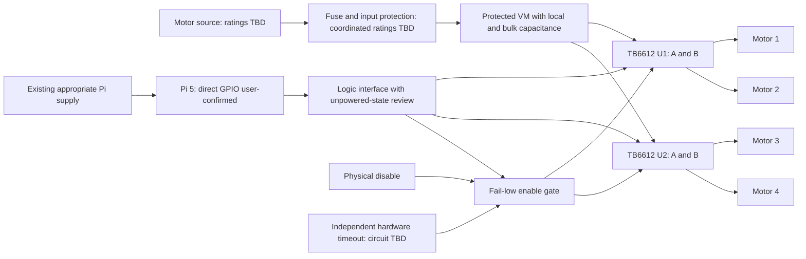

# Rev A architecture — implemented reference design

**Evidence update — 2026-09-28:** Earlier unknown motor voltage/ratio and encoder presence are superseded by the [purchase-record evidence](actual_hardware_evidence.md): listed 12 V, 30:1, 500-line GMR motors. The remaining text records earlier reviews, not current hardware verification. The preserved 6 V PCB is [incompatible with direct 12 V input](12v_design_impact.md); actual currents, battery voltage bounds/topology and GPIO wiring remain unresolved.

**PROVISIONAL REFERENCE DESIGN — NOT VERIFIED FOR THE EXISTING ROBOT.**
The design-only milestone now implements the shared-input variant of option B
below: two TB6612FNG ICs directly on the board, four separate motor-output pairs,
paired left/right commands and a direct Pi 5 logic interface. It is not a carrier
for the existing modules. No additional MCU is introduced.

| Design choice | Current implementation | Evidence / limitation |
|---|---|---|
| Motor allocation | U1A front-left, U1B front-right; U2A back-left, U2B back-right | User-confirmed wheel assignment; lead polarity NOT TESTED |
| Drive commands | Six buffered GPIO signals: two PWM and four direction, each fanned to both drivers | Four electrical channels, two commanded sides; no output paralleling |
| Enable interface | GPIO25 RUN, GPIO17 ARM and GPIO27 heartbeat; nine Pi output signals total | New hardware handshake is not implemented by the mock backend |
| Disable | TPS3431 independent timeout, logic/VM qualification, SW1 inhibit and deliberate-arm latch | Loss of qualification clears arm; recovery alone does not restart; physical behavior NOT TESTED |
| Pi connector | Custom 16-pin keyed J6 with Pi3V3 and six ground contacts | Not Pi 40-pin/HAT compatible; pin 15 GND, STBY accessible only at TP10 |
| Power path | F1 → D1 reverse blocker → Q1 qualified VM feed, bulk/local capacitance, bleed/TVS and VM monitor | Source/energy/sequencing restrictions in power specification; no motor current regulation |
| Board | Routed 100×80 mm, two layers, nominal 1 oz/1.6 mm reference; four 3.2 mm mounting holes | Chassis fit and final fabricated stackup unverified |
| Population | 107 schematic instances: 97 planned fitted parts +10 copper test points; four PCB-only holes | No fabricated or assembled board exists |

Authoritative implementation details are in
[reference_electrical_spec.md](reference_electrical_spec.md),
[power_circuit_spec.md](power_circuit_spec.md),
[enable_interface_spec.md](enable_interface_spec.md),
[pin_map.md](pin_map.md) and [schematic_review.md](schematic_review.md).
The historical GPIO-count table below predates separate RUN/ARM/heartbeat and
must not be used as the current connector contract.

Native KiCad 10.0.6 [ERC](../validation/design/erc_final.json) has zero
violations; [DRC](../validation/design/drc_final.json) has zero violations,
unconnected items and schematic-parity findings under recorded rules. Complete
schematic-to-manifest [netlist comparison](../validation/design/schematic_parity.json)
passes. These checks close native connectivity/rule findings for this reference
snapshot, not electrical safety or real-robot compatibility.

The fixed design boundary includes 5.5–6.5 V input, <=0.25 A RMS and
<=0.60 A/20 ms/10% per motor, <=40 C ambient and PI_3V3 3.2–3.4 V. The source
must initially charge at <=0.10 A, then remain capped at <=3 A and interrupt
persistent overload within 100 ms. Regenerated energy is limited to
3 mJ/event at <=1 Hz. Pi-first and motor-power-off-before-Pi sequencing are
required; abrupt Pi loss with residual VM is unvalidated. Independent watchdog
coverage does not include every software/hardware fault.

Fabrication and assembly are **DEFERRED / NOT BUILT / NOT ASSEMBLED**;
physical validation and integration are **NOT TESTED**. The earlier alternatives
and estimates below are retained design history, not remaining tasks for this
milestone or a fabrication/shipping promise. Vendor/assembly decisions remain
for a later authorized phase.

## Historical pre-CAD evaluation — preserved

The material below records the earlier requirements/audit gate. Statements such
as “no native CAD,” “not run,” “TBD circuit,” or “before schematic capture” refer
to that earlier stage and are superseded by the current section above and its
linked design records. The earlier calculations remain examples, not the
accepted reference operating specification. Real-robot unknowns remain unknown.

### Minimum Rev A — architecture review packet

**PROPOSED, not electrically approved.** Preferred project is one custom board integrating two TB6612FNG ICs if motor/source/thermal review supports them, four distinct motor outputs, defined controller/logic interface, reviewed input protection and local/bulk decoupling, fail-low enable, physical disable and test access. Retain the Pi on its appropriate existing supply. No HAT compliance claim.

#### Logic alternatives

Counts below exclude supply/ground and optional fault/disable sense. The user has confirmed direct Pi 5 GPIO control of both driver boards and no Arduino in the motor loop. Software PWM objects are not independent hardware PWM engines, and an alternate-function label does not guarantee a selected Pi 5 stack can provide the required waveform.

| Dimension | A: independently commanded four channels | B: four electrical channels, paired left/right commands |
|---|---|---|
| Direction/PWM signals | 8 direction + 4 PWM | Shared-input variant: 4 direction + 2 PWM fanned to matched-side IC inputs |
| STBY | 1 common or 2 individual | 1 common or 2 individual |
| Base GPIO count | 13 common / 14 individual STBY | 7 common / 8 individual STBY |
| Optional hardware heartbeat | Add 1 output; sense adds another if justified | Same additions |
| PWM demand | 4 independent waveforms; backend/pin mux TBD | 2 waveforms; input load/fanout and timing verified before use |
| Software effort | Per-wheel allocation, polarity, optional traction/control logic | Matches existing differential-drive commands; per-side behavior retained |
| Control value | Individual characterization/trim; useful only if application requires it | Sufficient proposed minimum for current left/right drive API |
| Wiring | More logic conductors; one separate output pair per motor | Fewer logic conductors with shared inputs; still four separate output pairs |
| Caveat | More pins does not provide feedback without encoders | Shared-input channels cannot be independently reversed/trimmed; lead polarity must be mapped |

An alternate B implementation uses 13/14 GPIOs and pairs channels in software; it has A's resource cost with paired behavior. Do not conflate it with seven-line fanout. Existing A/B wiring does not prove that either variant is already wired.

**Recommendation for review:** B paired commands for the initial behavior, because the existing API is differential drive and no per-wheel feedback requirement is established. Shared-input versus software pairing remains conditional on the actual Pi-to-driver wire fanout and assembly review. User-confirmed Board A/Board B both use channel A for left and B for right; this supports the paired concept but does not prove inputs are currently shared. The mock configuration has four channel records; it is not a schematic pin allocation. Select A only for a concrete independent-control requirement. No outputs are paralleled in any option.

#### Direct integration versus carrier

| Option | What it demonstrates | Main work/risk | Recommendation |
|---|---|---|---|
| Two SSOP24 ICs on custom PCB | Symbol/pad verification, power stage decoupling, high-current return design, thermal/rating selection, assembly inspection | Fine-pitch soldering/bridges, package heat, exact footprint and polarity | Preferred conditional Rev A; outsourced PCBA or supervised stencil/reflow, inspect under magnification |
| Carrier for existing modules | Connector/mechanical integration, system grounding/protection and modular servicing | Module dimensions/pinout/parts unknown; duplicated components/pull-ups may change states | Explicit fallback only if budget/tools prevent IC assembly; narrower claim, requires user review |

SSOP24 can be hand assembled by an experienced operator, but feasibility depends on actual tools and access. Do not silently turn the direct-driver project into a carrier. Budget, assembler and soldering capability remain TBD. No stock/price claims are made.

#### Power, enable and return concept

The diagram omits common reference connections for readability: electrical review must provide a continuous return plane and deliberate connector return paths. Motor VM must not power the Pi through a GPIO/header rail. Do not join two regulated supply outputs. Logic VCC source and buffering/isolation remain unresolved until actual VCC wiring and power sequencing are known. The user confirms a separate Pi supply, one motor battery feeding both VM inputs, and common Pi/driver/battery ground. A candidate Pi 3.3 V logic supply does not establish an unpowered-device current guarantee.

In each channel, analyze the loop VM capacitor → bridge → motor leads → bridge PGND → capacitor. Keep it compact; put the local ceramics directly at the appropriate VM/VCC and return pins. Bulk capacitance, source return, fuse and motor connectors form a separate high-current area. Keep control reference paths out of the motor current route using placement and a continuous plane; do not create arbitrary split ground islands. Review brake/freewheel/regenerative loops separately because a disconnected/BMS-blocked source may not absorb returned energy.

A physical switch should interrupt a reviewed enable-gating path or rated motor-power path. It must not short a HIGH Pi output to ground. STBY pull-downs and a fail-low gate are required conceptual defaults; final gate device, power-off behavior and resistor values need manufacturer evidence. STBY removes active bridge drive but does not galvanically disconnect the battery, guarantee rapid stopping, or make every output energy path safe. A motor-power switch must be DC/current-rated and coordinated with stored/regenerative energy. This is a prototype disable, not a certified emergency stop.

#### Watchdog decision

The mock controller's expiry protects against lost client refresh while its process/scheduler runs. It cannot protect against a frozen kernel, process killed before cleanup, stuck GPIO/peripheral PWM, welded switch or failed driver. With direct Pi GPIO now user-confirmed, normal operating release requires a reviewed independent fail-low timeout/enable mechanism for loss of software progress, or a documented constrained test setup that physically limits motion/energy and accepts the residual failure. Prefer a suitable watchdog/supervisor circuit over adding an unneeded MCU. The user confirms Arduino is not in the loop; no existing controller watchdog is assumed. Timeout interval, reset/latch behavior and stopping distance are TBD physical requirements.

#### Stackup and mechanical choice

Start with a **two-layer feasibility study**, continuous ground reference and compact power paths. Do not commit to two layers until current widths, return paths, connector fanout and mounting fit. Select four layers if necessary to maintain a ground reference and route safely within the real outline; verify copper/current assumptions again. Four layers solely for a portfolio appearance is not a reason. Board dimensions, hole coordinates, keep-outs, copper weight and assembler stackup are unresolved.

#### Work estimate (active work, not a delivery promise)

| Stage | Active engineering estimate | Gate |
|---|---|---|
| Audit, requirements, software mocks | 2–3 working days | This packet + hardware answers |
| Circuit/rating review and schematic | 2–3 days | Architecture/electrical acceptance |
| Layout, libraries, ERC/DRC and visual review | 3–4 days | Real dimensions and current rules |
| Manufacturing preparation/assembly planning | 1–2 days | User fabrication approval |
| Assembly, staged bring-up and documentation | 3–4 days | Boards/parts/instruments available |

Total roughly 11–16 active working days, potentially longer if ratings force a driver change. Separately reserve approximately 1–3 calendar weeks as an **unquoted planning allowance** for fabrication/assembly/shipping; actual lead time is TBD until vendor, destination, stock and quotation are known. Rework may add a fabrication cycle.

#### One requested review

Record acceptance or corrections for: B behavior versus A; direct IC board versus explicit carrier fallback; user-confirmed direct Pi path and remaining signal fanout; qualified driver/supply/protection; independent disable/watchdog requirement; outline/mounting and assembly route. Electrical and CAD freeze remain blocked while values are TBD. Continue mock tests, source verification and blank validation preparation meanwhile.
