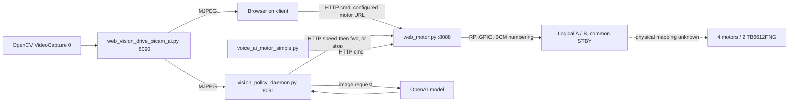

# Existing system audit — Rev A entry review

**Evidence update — 2026-09-28:** Earlier unknown motor voltage/ratio and encoder presence are superseded by the [purchase-record evidence](actual_hardware_evidence.md): listed 12 V, 30:1, 500-line GMR motors. The remaining text records earlier reviews, not current hardware verification. The preserved 6 V PCB is [incompatible with direct 12 V input](12v_design_impact.md); actual currents, battery voltage bounds/topology and GPIO wiring remain unresolved.

Audit date: 2026-09-27 America/New_York (2026-09-28 UTC). Baseline: `034882cb2ce8106982508cf1a8309b4fa69673ff`, `main`, https://github.com/searchyourmind/AI_Robot. All source locations below refer to this baseline, before this session's safety changes. Retrieve with `git show 034882c:path`.

The public repository was cloned into this session's `outputs/AI_Robot`. Initial `git status --short --branch` was clean (`main...origin/main`); all three commits were retained. No prior working copy was found in the searched workspace/Developer/Projects locations. No tracked `AGENTS.md`, CAD, tests, wiring drawings, Arduino sketches, or service unit files were found. Parent instruction-file checks found none. No push, deployment, hardware connection, purchase, or model call was performed.

## Evidence vocabulary

- **CONFIRMED IN CODE**: a source fact, not evidence of a running or tested robot.
- **DOCUMENTED ONLY**: README assertions without runtime/physical evidence.
- **USER-CONFIRMED HARDWARE**: four DC motors and two TB6612FNG devices/modules; Pi-based robot.
- **UNKNOWN**: cannot be resolved from this checkout.
- **PROPOSED**: a Rev A design or draft change; not a verified physical configuration.

## Architecture and command paths



This diagram describes baseline source intent, not observed wiring. **CONFIRMED IN CODE:** `web_motor.py` directly imports `RPi.GPIO` (line 4); no serial, I2C motor-controller protocol, Arduino firmware, or controller transport exists in any tracked file. **UNKNOWN FROM CODE:** physical controller path cannot be established from the repository alone. **USER-CONFIRMED HARDWARE, follow-up 2026-09-28:** both boards are controlled directly by Pi 5 GPIO and Arduino is not currently in the motor loop; this closes the architecture question without asserting physical verification.

## Findings

| ID | Classification | Source / function | Finding and consequence |
|---|---|---|---|
| A01 | USER-CONFIRMED HARDWARE | User project brief §1 | Four physical motors, two TB6612FNG devices/modules. Two logical groups are not two physical motors. |
| A02 | DOCUMENTED ONLY | Both READMEs, Hardware Setup | Pi 5 used; camera `/dev/video0`; 3.3 V driver logic; example motor power 6–9 V. This is not an exact battery specification. The old single-driver/two-motor description is incomplete relative to user-confirmed hardware. |
| A03 | CONFIRMED IN CODE | `web_motor.py:8–16` | BCM `18,23,24` for A; `13,5,6` for B; common STBY `25`. Only two PWM objects. No mapping to driver 1/2 or four wheel positions. |
| A04 | CONFIRMED IN CODE | Module initialization, lines 18–28 | Import configures output pins sequentially then writes low; no `initial=LOW` atomic setup, external pull-down, or power-sequencing evidence. PWM requested at 1 kHz through `GPIO.PWM`. PWM implementation/timing depends on the installed provider. |
| A05 | CONFIRMED IN CODE | `__main__`, `standby()` | Server enables STBY before accepting requests. No explicit operator arm, physical disable feedback, fault latch, or owner. Hardware startup behavior remains UNKNOWN. |
| A06 | CONFIRMED IN CODE | `stop_all()`, lines 38–44 | Sets STBY HIGH, both direction inputs LOW and duty 0. It never requests standby. Toshiba truth table distinguishes IN1=IN2=LOW/PWM=HIGH stop (high impedance) from PWM=LOW short brake for a driven direction. The all-LOW combination used here is not explicitly listed in the table. This code is not evidence of coast or power interruption; see circuit review. |
| A07 | CONFIRMED IN CODE | `forward/backward/left/right` | A/B directions HIGH/LOW are software polarity assumptions. `left` reverses A, drives B forward; `right` does the converse. Physical forward/polarity UNKNOWN. No ramp, current check, or reversal interval. |
| A08 | CONFIRMED IN CODE | `cmd()`, lines 98–122 | GET mutates outputs; missing/default commands are loosely handled. `int`/`float` failures escape. `pulse_fwd` calls `forward()` before parsing duration: malformed, negative, NaN or infinite input can raise before `stop_all()` with no local finally, leaving drive active; large valid durations are unbounded. `speed` clamps silently. |
| A09 | CONFIRMED IN CODE | `cmd():pulse_fwd`, Flask startup | Sleeping handler; no motor-state lock. With concurrent requests a later stop can be followed by another drive command, and an older pulse completion can stop a newer command. Single-thread execution instead delays stop. Neither is acceptable arbitration. |
| A10 | CONFIRMED IN CODE | All motor state/functions | No command expiry, watchdog, owner lease, disconnect handling, replay protection, or stale-command guard. Last output persists without a new command. |
| A11 | CONFIRMED IN CODE | `__main__:finally` | Calls `stop_all()` (STBY HIGH) then GPIO cleanup. No PWM stop call, fail-low pin guarantee after cleanup, SIGKILL/OS-hang coverage, or verified power-off state. |
| A12 | CONFIRMED IN CODE | `vision_policy_daemon.parse_policy()` | Substring test matches key `stop_sign` even when its `present` value is false. Required false/false JSON produces `stop` in baseline. No JSON type/schema checks. |
| A13 | CONFIRMED IN CODE | `apply_policy()` | `slow` and `go` perform separate speed and forward HTTP calls; a browser stop can be overridden by the second AI call. Exceptions only print; HTTP error status is not checked. |
| A14 | CONFIRMED IN CODE | `get_frame_from_stream`, `policy_loop` | No capture timestamp, maximum result age, or bounded MJPEG buffer. None/malformed/model/network failures do not explicitly revoke motion. A 30-second model timeout plus camera/network delay can yield an old decision. |
| A15 | CONFIRMED IN CODE | Vision module globals | OpenAI/httpx client created at import; camera module opens device at import. These side effects obstruct safe tests. Import is not a paid call but can require credentials/devices. |
| A16 | CONFIRMED IN CODE | Camera `HTML_PAGE`, `MOTOR_URL` | Browser fetch defaults to `127.0.0.1:8088` on the browser's computer, not necessarily the Pi. Port 8090→8088 is cross-origin and no CORS policy is implemented. UI does not report HTTP failures. |
| A17 | CONFIRMED IN CODE | Camera `mjpeg_generator()` | Each viewer reads shared capture under a lock; failed capture reopens in a tight loop. No provenance or calibrated sensor exposure timestamp. |
| A18 | CONFIRMED IN CODE | CLI top-level loop | Input/network at import; no request timeout or status checks. Quit/EOF/interrupt do not send stop. |
| A19 | CONFIRMED IN CODE | `requirements.txt` | Unpinned dependencies; neither `RPi.GPIO` nor `rpi-lgpio` declared. Import spelling cannot identify the distribution. No lockfile or target Pi inventory. |
| A20 | UNKNOWN | Target Pi unavailable | Actual OS/kernel, GPIO provider/version/path, pin mux/conflicts, PWM timing and Pi 5 compatibility not verified. The local Mac cannot establish these. |
| A21 | CONFIRMED IN CODE | Complete tracked-file inventory | No native CAD, BOM, manufacturing exports, physical measurements, automated tests, service manager, or encoder/sensor wiring. Absence of repository evidence does not prove absence of real hardware work. |
| A22 | PROPOSED | This session's mock changes | Central ownership/arming/expiry, four mock channels, AI inhibit-only policy, source freshness, and safe imports. See software and vision docs plus actual test report; not deployed or physically validated. |

## Target Pi evidence still required (read-only, no actuation)

Run only on the actual Pi after reviewing its environment; these commands do not configure pins:

```sh
uname -a
cat /etc/os-release
python3 -m pip show RPi.GPIO rpi-lgpio lgpio
dpkg-query -W python3-rpi.gpio python3-rpi-lgpio python3-lgpio
python3 -c 'from importlib import metadata, util; print(metadata.packages_distributions().get("RPi")); print(util.find_spec("RPi"))'
```

The dotted import `RPi.GPIO` may be provided by different distributions; record the interpreter/virtual environment used by the real service, package metadata, and its installed source path before selecting a backend. Do not install competing providers blindly. Record service launch configuration, other GPIO users, camera stack and complete wire map. Official Pi/rpi-lgpio sources are listed in `design_sources.md`.

## Audit exit state

Source audit complete for all eight tracked files (seven project files plus `.gitignore`). User follow-up confirms the driver-channel-to-wheel map and direct Pi 5 control; exact GPIO fanout, polarity, electrical ratings and Pi provider remain unresolved. No assertion of assembled/tested Rev A, electrical suitability or Pi 5 GPIO compatibility is made.

## User hardware clarification (2026-09-28)

**USER-CONFIRMED HARDWARE:** four geared DC motors; Board A A→front-left and B→front-right, Board B A→back-left and B→back-right; direct Pi 5 GPIO; Arduino absent from motor-control loop; separate Pi supply; common motor battery feeding both VM inputs; shared Pi/driver/battery-negative ground; Pi Camera, USB microphone and speaker. Wheel encoders are not integrated; physical presence is TBD. All motor ratings, battery voltage/protection, board dimensions, budget, assembly method, instruments and vendor are TBD. The proposed board should consolidate existing jumper-wire motor/power/control connections. These facts update the physical context without changing the baseline code audit above.
