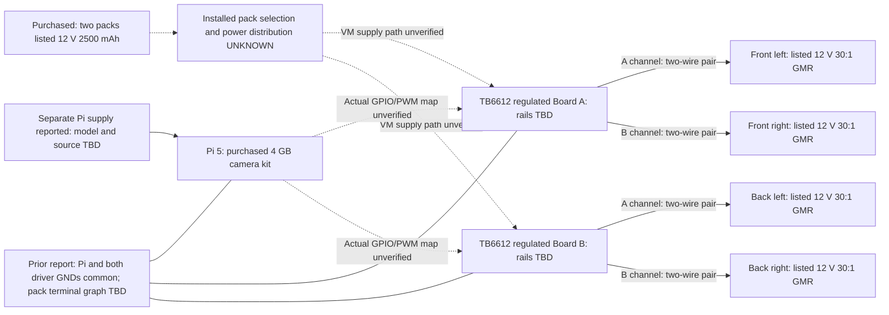
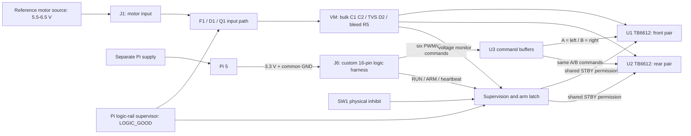

# Wiring guide: existing robot versus proposed Rev A

**Current compatibility finding:** The existing CAD is a 6 V reference and cannot accept direct 12 V input. The proposed diagram below remains an explanation of that preserved reference, not a wiring instruction for the purchased hardware. See [12v_design_impact.md](12v_design_impact.md).

**PROVISIONAL REFERENCE DESIGN — NOT VERIFIED FOR THE EXISTING ROBOT.**
**DRAFT — NOT RELEASED FOR FABRICATION.** This is a documentation review, not an instruction to connect or energize the draft board. No wire continuity or motor polarity was measured. Read [actual hardware evidence](actual_hardware_evidence.md) and [design decisions](design_decisions.md) alongside the native schematic.

## 1. Existing robot: what the user has actually confirmed

Solid wheel connections retain the user's channel assignment; each arrow denotes an OUT1/OUT2 pair, not a single wire or ground. Dashed connections explicitly represent unresolved actual wiring. The earlier report that one motor battery feeds both VM inputs is retained as history and needs reconciliation with the two-pack inventory. Two purchased packs do not establish series/parallel wiring, one pack per driver, a shared supply, or which pack is installed. This diagram instructs none of those connections.

Direct Pi control, separate Pi supply and common ground are prior user reports. The exact Pi source and pack-terminal return graph remain open. Driver VCC sources, regulated rails, GPIO fanout, motor lead polarity, module protection/capacitors, physical switch and E-stop remain **unknown**. Historical BCM constants establish code intent only, including for Board A; the second driver's mapping is specifically still missing. No Arduino is in the reported control loop.

Encoder hardware is now purchase-confirmed as listed 500-line GMR, but encoder pinout, voltage, count convention and actual integration remain unknown. The current reference PCB has no reviewed encoder interface. See the [manufacturer-source review](wheeltec_source_review.md).

## 2. Proposed Rev A power and permission paths

This diagram separates the energy path from the enable path. SW1 inhibits STBY; it **does not switch J1/VM power**. Q1 responds to LOGIC_GOOD, not SW1 or ARM. Both supplies share a reference ground; the board has no galvanic isolation and does not generate the Pi's 5 V supply. The source must also meet the controlled charging, current ceiling, overload cutoff, regeneration and shutdown limits in [reference_electrical_spec.md](reference_electrical_spec.md). A nominal battery voltage alone cannot establish compatibility.

## 3. Four motor connectors: separate power outputs, two command groups

| Wheel / existing confirmed channel | Proposed IC channel | Proposed connector | Pin 1 / pin 2 | Command group |
|---|---|---|---|---|
| Front left / Board A A | U1 A | J2 | FL_OUT1 / FL_OUT2 | Left |
| Front right / Board A B | U1 B | J3 | FR_OUT1 / FR_OUT2 | Right |
| Back left / Board B A | U2 A | J4 | BL_OUT1 / BL_OUT2 | Left |
| Back right / Board B B | U2 B | J5 | BR_OUT1 / BR_OUT2 | Right |

Four H-bridge channels mean **four output pairs / eight motor terminals**, not four single-ended outputs. Do not connect either motor lead permanently to ground or connect separate bridge outputs together. The IC's duplicate pins for a single output are different: those same-output package pins are joined as specified in the manufacturer pin table.

A-command inputs are physically shared between U1/U2; B-command inputs are physically shared between U1/U2. This Rev A implements left/right pairing in copper, not merely in a software setting. One side's two motors can draw different currents and rotate at different speeds despite identical PWM. Independent wheel speed commands would require a revised hardware interface and backend; encoder feedback would be an additional feature. All four power channels share VM/GND, so “separate” does not mean electrically isolated supplies.

J1.1 is MOTOR_IN positive; J1.2 is GND. Motor pin 1 is an electrical terminal label, not a guaranteed “forward” polarity. Each physical wheel's forward direction remains unknown until its actual lead orientation is established.

## 4. Proposed Pi-to-J6 electrical wire table

The table is a **proposal derived from the Rev A schematic**, not a discovered existing cable. BCM/GPIO numbering differs from physical header positions. Identify connector pin 1 using the native footprint/manufacturer drawing; this table does not assume a photograph view or assign wire colors. J6 is not a Pi 40-pin HAT connector.

| J6 pin | PCB net / role | Proposed Pi BCM | Pi physical pin |
|---:|---|---:|---:|
| 1 | PI_3V3 logic supply | supply | 1 |
| 2 | GND | ground | 6 |
| 3 | GPIO18 → buffered PWMA, both drivers / left | 18 | 12 |
| 4 | GND | ground | 9 |
| 5 | GPIO23 → buffered AIN1, both drivers | 23 | 16 |
| 6 | GPIO24 → buffered AIN2, both drivers | 24 | 18 |
| 7 | GPIO13 → buffered PWMB, both drivers / right | 13 | 33 |
| 8 | GND | ground | 14 |
| 9 | GPIO5 → buffered BIN1, both drivers | 5 | 29 |
| 10 | GPIO6 → buffered BIN2, both drivers | 6 | 31 |
| 11 | GPIO25 → RUN request, not direct STBY | 25 | 22 |
| 12 | GPIO17 → ARM edge | 17 | 11 |
| 13 | GPIO27 → heartbeat | 27 | 13 |
| 14 | GND | ground | 20 |
| 15 | GND; no STBY feedback | ground | 30 |
| 16 | GND | ground | 25 |

Only J6.1 uses a Pi supply rail; do not interpret any J6 number as a matching Pi header number. Neither Pi 5 V pin 2 nor pin 4 connects to this board. STBY is accessible at TP10 for a later authorized measurement; no Pi GPIO connects directly to STBY. The actual robot's driver VCC source still needs evidence. If an existing module uses VCC=5 V, TB6612's 0.7×VCC high threshold is 3.5 V: a nominal 3.3 V Pi output cannot simply be assumed to satisfy that interface.

The historical GPIO25 role was direct STBY. Rev A changes it to RUN and adds ARM/HB. The repository currently has a mock backend only; no live GPIO implementation of this new handshake has been validated. Do not reuse the historical pin constants as if the new hardware were integrated.

## 5. Stop and disable are different mechanisms

| Mechanism | Path / intended result | What it does not establish |
|---|---|---|
| Software stop/disarm | Software asks a backend to remove drive. Current mock semantics include zero demands and STBY false. A future Rev A backend would clear RUN and obey the hardware protocol. | No current real GPIO implementation; software needs a functioning execution/output path. |
| SW1 hardware inhibit | PHYS_RAW low → qualification/latch clear → U10 pulls STBY low. It bypasses HTTP/Python execution while its logic rail and components operate. | Does not interrupt motor power or remove capacitor energy; not a guaranteed instantaneous wheel stop. |
| Watchdog timeout | Missing heartbeat clears permission/latch through separate circuitry. Datasheet interval is 170–230 ms for the selected configuration. | Not a mechanical stop-time measurement; a faulty process can keep a valid heartbeat running. |
| Motor-source disconnection | Would remove external source energy through an appropriate source switch arrangement. Existing implementation is unknown; SW1 is not this switch. | Stored energy and motor motion do not disappear instantly. No safety-rated E-stop has been established. |

Under valid driver supplies, STBY low requests high-impedance standby and allows coasting. It is not active short-brake. PWM=0 alone is not a universal coast command: for complementary direction inputs with STBY high, TB6612 uses short braking. After a fault, returning SW1 to ENABLE does not set the cleared latch; a new ARM edge is required. The hardware recognizes an edge, not human intent. A software-generated edge is possible; there is no separate physical arm button on this PCB.

Abrupt Pi 3.3 V loss with VM still charged remains unresolved. The watchdog and gate logic also use Pi 3.3 V, and a normal-power truth table cannot prove the unpowered driver's state. This limitation must remain visible when explaining the design.

Sources: [Toshiba TB6612FNG pins/modes, pp2–4](https://toshiba.semicon-storage.com/info/datasheet_en_20141001.pdf?did=10660), [Pi GPIO documentation](https://www.raspberrypi.com/documentation/computers/raspberry-pi.html#gpio-and-the-40-pin-header), [TI TPS3431](https://www.ti.com/lit/ds/symlink/tps3431.pdf), [TI SN74LVC1G74](https://www.ti.com/lit/ds/symlink/sn74lvc1g74.pdf). Project connections were checked against the delivered native schematic/net manifest; board/motor operation was not tested.
